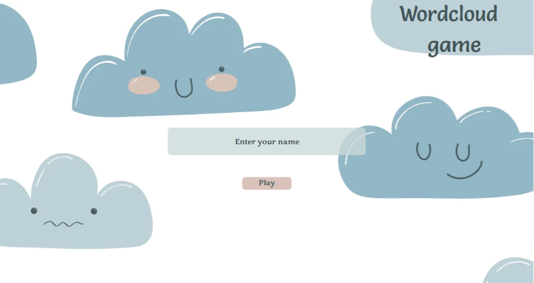
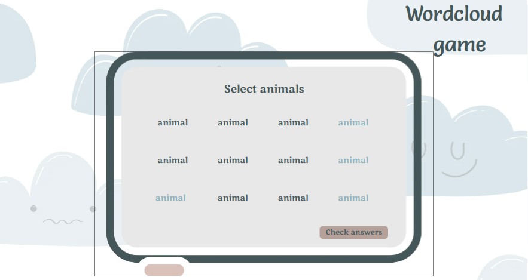
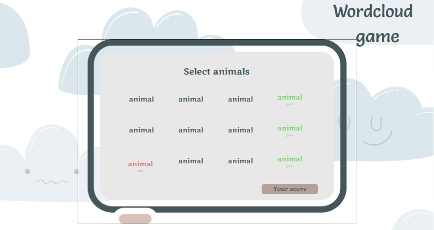
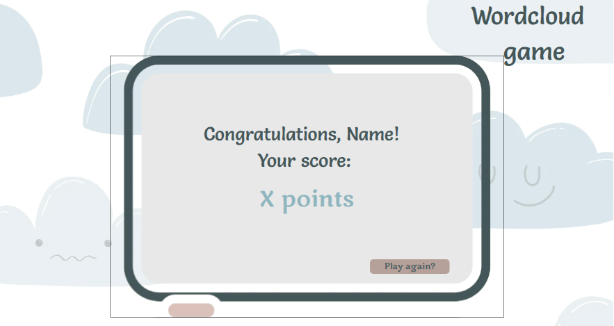

# Word Cloud Game

## About

**A cute and simple game in which the user selects words from a word cloud that match a given definition.**

### Learning goals

This project focuses on building skills in component-based architecture, state management in React, type-safe data modeling with TypeScript, working with modern tools like Vite, also unit and end-to-end testing using Playwright.
### Tech stack

• ⚛️ **React** • 🟦 **TypeScript** • ⚡ **Vite** • 🎭 **Playwright** •

## Project setup

Install dependencies:

```bash
npm install
```

Start the development server and open the URL displayed in the terminal:

```bash
npm run dev
```

Build the project for production:

```bash
npm run build
```

## Preview

**Welcome screen:**



**Game boards:**




**Score board:**

